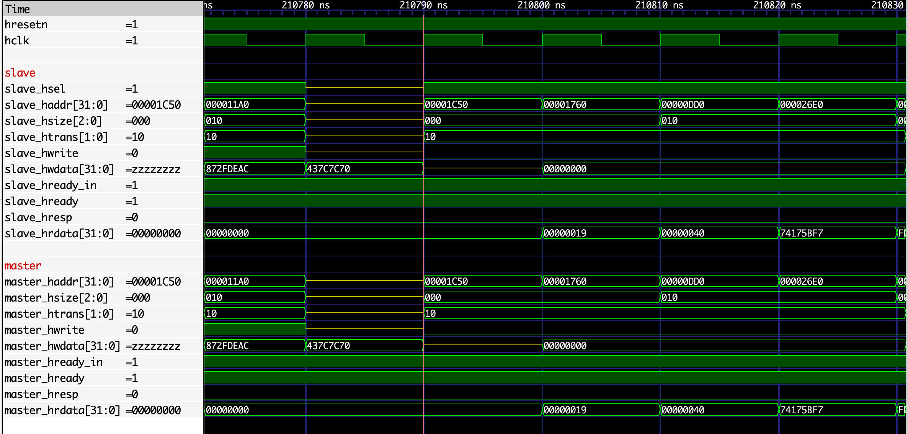
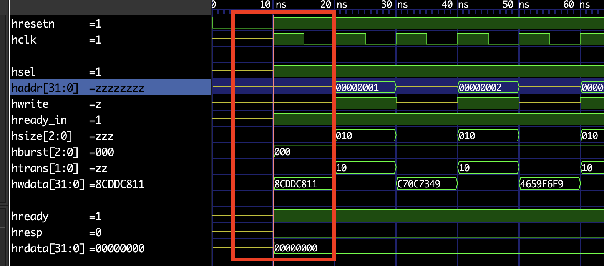

[](https://github.com/aignacio/cocotbext-ahb/actions/workflows/run.yaml) [](https://codecov.io/gh/aignacio/cocotbext-ahb) [](https://pepy.tech/project/cocotbext-ahb) [](https://badge.fury.io/py/cocotbext-ahb)

# Cocotb AHB bus driver

## Table of Contents
* [Introduction](#intro)
* [Installation](#install)
* [Classes and usage example](#classes)
   - [AHB Bus](#ahb_bus)
   - [AHB Master](#ahb_master)
   - [AHB Slave](#ahb_slave)
   - [AHB monitor](#ahb_monitor)
* [Issue with first txn](#issue_w_first)
* [License](#lic)

## <a name="intro"></a> Introduction

This repository contains AHB drivers (AHB and AHB Lite) and a monitor for [cocotb](https://github.com/cocotb/cocotb).

## <a name="install"></a> Installation

Installation from pip (release version, stable):
```bash
$ pip install cocotbext-ahb
```
Installation for active development:
```bash
$ git clone https://github.com/aignacio/cocotbext-ahb
```
The repository contains a small script that starts a container fetched from Docker Hub, equipped with all the required development tools.
```bash
$ cd cocotbext-ahb/
$ ./ship.sh
# To run all tests
$ nox
# To run a specific test
$ nox -s run -- -k "test_ahb_lite.py"
# To run lint
$ nox -s lint
```

Once the container is up and running, to run the tests through [nox](https://nox.thea.codes/en/stable/) and [pytest](https://docs.pytest.org/), run the following:
```bash
$ nox -l # See the available build options
$ nox -s run-3.xx # Replace xx by a python version you want to test
```
The command above will take some time to complete (depends on your machine cfg) because it will run all the tests and its variants, generating waveforms in each `run_dir/*` folder. At the end of the test run, you can open the waveforms for each test in this format using gtkwave:
```bash
gtkwave run_dir/sim_build_icarus_(TEST_NAME)/ahb_template.fst  docs_utils/template.gtkw
```

Running specific tests:
```bash
$ nox -s run-3.10 -- -k "test_ahb_monitor_slave" # Runs on python 3.10, the test_ahb_monitor_slave
```
For the list of test, please check the [`tests/`](tests/) directory.

## <a name="classes"></a> Classes and usage example

This AHB extension is composed by master, slaves and a single monitor. Thus, the following available classes are:

* **AHB Master** - WIP for burst support, base class AHB Lite Master
* **AHB Lite Master** - Perform AHB transactions in non-/pipeline mode
* **AHB Slave** - WIP for burst support, base class AHB Lite Slave
* **AHB Lite Slave** - Support any type of AHB transaction but burst with back-pressure option and configurable default value 
* **AHB Monitor** - Basic monitor to check AHB transactions, extends from [Monitor](https://github.com/cocotb/cocotb-bus/blob/master/src/cocotb_bus/monitors/__init__.py#L30) cocotb-bus class 

### <a name="ahb_bus"></a> AHB Bus

All the different master/slaves and also the monitor requires an **AHBBus** object to be passed to their constructors. This AHBBus object will map each of the AHB I/F pins the dut, some IOs are mandatory but others are optional. In order to create an AHBBus object, here are the two ways.

With a prefix:
```python
# In case your DUT has some prefix for the AHB I/F
# For instance if all AHB signals are following this convention:
# - test_haddr
# - test_hsel
# - ...
AHBBus.from_prefix(dut, "test")
```

Without a prefix:
```python
# In case your DUT has no prefix for the AHB I/F
# For instance if all AHB signals are following this convention:
# - haddr
# - hsel
# - ...
AHBBus.from_entity(dut)
```

For reference, down below is the class header of [AHB Bus](cocotbext/ahb/ahb_bus.py). More arguments can also be passed as this extends from [cocotb-bus](https://github.com/cocotb/cocotb-bus) base class.
```python
class AHBBus(Bus):
    _signals = ["haddr", "hsize", "htrans", "hwdata",
                "hrdata", "hwrite", "hready", "hresp"]

    _optional_signals = ["hburst", "hmastlock", "hprot", "hnonsec",
                         "hexcl", "hmaster", "hexokay", "hsel", "hready_in"]
```

#### Mandatory vs optional AHB signals

1. AHB Master signals

##### Mandatory

* haddr - Indicates AHB txn address 
* hsize - Indicates AHB txn size
* htrans - Indicates AHB txn type
* hwdata - Indicates AHB data to be written
* hwrite - Indicates type of AHB txn

##### Optional

* hburst
* hmastlock
* hprot
* hnonsec
* hexcl
* hmaster
* hsel 
* hready_in *(Note a)*

Notes:
a. This signal is driven high during the txn start but it does not follow the **hreadyout** loopback from the slave when the slave is not available, if the loopback is expected, suggestion is to connect the `hready_in` directly to the `hreadyout`

2. AHB Slave signals 

##### Mandatory

* hresp - Indicates AHB txn response type
* hrdata - Indicates AHB txn read data
* hready - Indicates AHB slave availability

##### Optional

* hexokay

##### Signal customization for your design
To customize signals name to your design `signals` and `optional_signals` dictionnary can be provide. 
```python
AHBBus.from_prefix(
    dut, 
    prefix = "slave_driver",
    signals = {
        "haddr" : "haddr",
        "hsize" : "hsize",
        "htrans" : "htrans",
        "hwdata" : "hwdata",
        "hrdata" : "hrdata",
        "hwrite" : "hwrite",
        "hready" : "hreadyout",
        "hresp" : "hresp"
    }
,
    optional_signals = {
        "hsel" : "hsel",
        "hready_in" : "hready"
    }
)
```

#### Mandatory vs optional AHB signals

1. AHB Master signals

##### Mandatory

* haddr - Indicates AHB txn address 
* hsize - Indicates AHB txn size
* htrans - Indicates AHB txn type
* hwdata - Indicates AHB data to be written
* hwrite - Indicates type of AHB txn

##### Optional

* hburst

### <a name="ahb_master"></a> AHB Master

Both AHB Master [WIP] and AHB Lite Master classes have the same constructor arguments. Within the arguments, it is required to pass the AHB Bus object, the clock and reset DUT pins. As optional args, a timeout value in clock cycles (per AHB txn), the default value of the master driven IOs and the name of the object.
```python
class AHBLiteMaster:
    def __init__(
        self,
        bus: AHBBus,
        clock: str,
        reset: str,
        timeout: int = 100,
        def_val: Union[int, str] = "Z",
        name: str = "ahb_lite",
        **kwargs,
    ):
```

In case of AHB Slave error response, the master will cancel the current transaction changing HTRANS from NSEQ to IDLE in the second clock cycle of the error response and then it will retry immediately after (following clock cycle). This is not mandatory but gives time for the master to decide whether it needs to be aborted or not the following transaction.

Its methods are composed by **read()**, **write()** and **custom()**. 

#### Write

For writes, the arguments are listed here:

```python
    async def write(
        self,        
        address: Union[int, Sequence[int]],
        value: Union[int, Sequence[int]],
        size: Optional[Union[int, Sequence[int]]] = None,
        pip: Optional[bool] = False,
        verbose: Optional[bool] = False,
        sync: Optional[bool] = False,
        format_amba: Optional[bool] = False,
    ) -> Sequence[dict]:
```

**Arguments**
* address - Single or a list of integer addresses to be written
* value - Single or a list of integer values to be written
* Optional[size] - Integer number of bytes to be written (for instance, in 32-bit bus, 1, 2 or 4 bytes), default is the max bus size
* Optional[pip] - Define if the address/data phase will overlap in a pipeline manner or not, default non-pipelined 
* Optional[verbose] - Print a msg on every txn
* Optional[sync] - Drive signals on next clk edge
* Optional[format_amba] - Enforce AMBA data masking/shifting according to spec (Table 6-1 Active byte lanes for a 32-bit little-endian data bus - ARM IHI 0033B.b)

**Return**
* Sequence[dict] - Once all transactions are dispatched and their responses are received, the function returns a list of dict with [AHBResp](cocotbext/ahb/ahb_types.py) responses along with the data.

*Note*: address, value and size have to match their length if provided.

#### Read

For reads, the arguments are listed here:

```python
    async def read(
        self,
        address: Union[int, Sequence[int]],
        size: Optional[Union[int, Sequence[int]]] = None,
        pip: Optional[bool] = False,
        verbose: Optional[bool] = False,
        sync: Optional[bool] = False,
    ) -> Sequence[dict]:
```

**Arguments**
* address - Single or a list of integer addresses to be read from
* Optional[size] - Integer number of bytes to be read (for instance, in 32-bit bus, 1, 2 or 4 bytes), default is the max bus size
* Optional[pip] - Define if the address/data phase will overlap in a pipeline manner or not, default non-pipelined 
* Optional[sync] - Drive signals on next clk edge
* Optional[verbose] - Print a msg on every txn

**Return**
* Sequence[dict] - Once all transactions are dispatched and their responses are received, the function returns a list of dict with [AHBResp](cocotbext/ahb/ahb_types.py) responses along with the data.

*Note*: address and size have to match their length if provided.

#### Custom

A third method provides flexibility in case the user wants to perform read or writes together like back-to-back operations such as WAR or RAW. For this, the arguments are listed here:

```python
    async def custom(
        self,
        address: Union[int, Sequence[int]],
        value: Union[int, Sequence[int]],
        mode: Union[int, Sequence[int]],
        size: Optional[Union[int, Sequence[int]]] = None,
        pip: Optional[bool],
        verbose: Optional[bool] = False,
    ) -> Sequence[dict]:
```

**Arguments**
* address - Single or a list of integer addresses to be written to or read from
* value - Single or a list of integer addresses to be written to or read from
* mode - Single or a list of operation types - 0 (Read) or 1 (Write)
* Optional[size] - Integer number of bytes to be written/read (for instance, in 32-bit bus, 1, 2 or 4 bytes), default is the max bus size
* Optional[pip] - Define if the address/data phase will overlap in a pipeline manner or not, default non-pipelined 
* Optional[sync] - Drive signals on next clk edge
* Optional[verbose] - Print a msg on every txn

**Return**
* Sequence[dict] - Once all transactions are dispatched and their responses are received, the function returns a list of dict with [AHBResp](cocotbext/ahb/ahb_types.py) responses along with the data.

*Note*: address, value, mode and size have to match their length if provided.

### <a name="ahb_slave"></a> AHB Slave

Both AHB Slave [WIP] and AHB Lite Slave classes have the same constructor arguments. Within the arguments, it is required to pass the AHB Bus object, the clock and reset DUT pins. As optional arg, the default value of the slave driven IOs, a generator function to force back-pressure and the name of the object.

```python
class AHBLiteSlave:
    def __init__(
        self,
        bus: AHBBus,
        clock: str,
        reset: str,
        bp: Generator[int, None, None] = None,
        name: str = "ahb_lite",
        reset_act_low: bool = True,
        **kwargs,
    ):
```

The AHB slaves will not provide any specific data (always zero) or unexpected response, they serve as a basic slave just to check its connectivity while testing AHB Master and as a base class for the AHB Lite Slave RAM. The back-pressure feature is a way to force the slave to demonstrated unavailability while the master issue AHB transactions. The generator needs to return bool type values where bool True indicates slave available and bool False indicate slave unavailable. 

In case of an AHB error response, the Slave inserts a wait state (HREADY == LOW && HRESP == OKAY) however this not required and might change in the future sticking only to the mandatory obligation of 2-cycle error response:

* First: HREADY == LOW / HRESP == ERROR
* Second: HREADY == HIGH / HRESP == ERROR

*Note*: Following ARM's spec, the slave needs to assert HREADY (or HREADYOUT) high during reset, it is assumed that the `reset` argument is **active-low**.

#### AHB Lite Slave RAM 

The AHB Lite Slave RAM is a basic memory slave that can receive reads and write like a normal memory-mapped device. The only difference between the normal slave vs this one is the fact that as part of its constructor, a new argument **mem_size** is listed. This argument defines a memory size in bytes for the AHB slave. The only limitation for now, is the fact that all memory addresses have to be aligned to the data bus width, i.e for 32-bit slaves, address[1:0] == 2'b00.

```python
class AHBLiteSlaveRAM(AHBLiteSlave):
    def __init__(
        self,
        bus: AHBBus,
        clock: str,
        reset: str,
        bp: Generator[int, None, None] = None,
        name: str = "ahb_lite_ram",
        mem_size: int = 1024,
        **kwargs,
    ):
```

Thank you [@alexforencich](https://github.com/alexforencich/cocotbext-axi) for your work on the memory classes that were leveraged in this project.

### <a name="ahb_monitor"></a> AHB Monitor

A basic AHB monitor was also developed, the idea is to ensure that basic protocol assumptions are respected throughout assertions, its constructor arguments are very similar to the previous discussed classes. For now, the monitor checks for basic protocol violations such as :

- Ensure the master/bus decoder does not change its address phase transaction qualifiers (hsel[if app], haddr, htrans, hwrite) while the slave is not available (hready == 0);
- Ensure the master/bus decoder does not change its data phase transaction qualifier (hwdata) while the slave is not available (hready == 0);
- Checks that an AHB error response coming from the slave is following the 2-cycle response defined in the AMBA spec.
- Ensure slave cannot back-pressure during address phase.

```python
class AHBMonitor(Monitor):
    def __init__(
        self, 
        bus: AHBBus, 
        clock: str, 
        reset: str, 
        prefix: str = None, 
        **kwargs: Any
    ) -> None:
```

As the monitor is extended from [Monitor](https://github.com/cocotb/cocotb-bus/blob/master/src/cocotb_bus/monitors/__init__.py#L30) cocotb-bus class, it is possible to pass its object as a callable reference to a [Scoreboard](https://github.com/cocotb/cocotb-bus/blob/master/src/cocotb_bus/scoreboard.py#L18) object and use it to compare transactions. For reference, please check the [`tests/test_ahb_lite_monitor_scoreboard.py`](tests/test_ahb_lite_monitor_scoreboard.py) and see how its implemented.

### Example

A basic example of this extension usage is demonstrated below and also within the [tests folder](test/) that are available.

```python
import cocotb
import os
import random
import math

from const import cfg
from cocotb_test.simulator import run
from cocotb.triggers import ClockCycles
from cocotb.clock import Clock
from cocotbext.ahb import AHBBus, AHBLiteMaster, AHBLiteSlaveRAM, AHBResp, AHBMonitor

def rnd_val(bit: int = 0, zero: bool = True):
    if zero is True:
        return random.randint(0, (2**bit) - 1)
    else:
        return random.randint(1, (2**bit) - 1)


def pick_random_value(input_list):
    if input_list:
        return random.choice(input_list)
    else:
        return None  # Return None if the list is empty

async def run_test(dut):
    data_width = 32
    mem_size_kib = 16
    N = 1000

    # Map the bus monitor to the I/F slave_h* I/F
    ahb_lite_mon = AHBMonitor(
        AHBBus.from_prefix(dut, "slave"), dut.hclk, dut.hresetn
    )

    # Create an AHB Lite Slave RAM connected to the master I/F
    ahb_lite_sram = AHBLiteSlaveRAM(
        AHBBus.from_prefix(dut, "master"),
        dut.hclk,
        dut.hresetn,
        bp=bp_fn,
        mem_size=mem_size_kib * 1024,
    )

    # Create an AHB Lite Master connected to the slave I/F
    ahb_lite_master = AHBLiteMaster(
        AHBBus.from_prefix(dut, "slave"), dut.hclk, dut.hresetn, def_val="Z"
    )
   
    # Create a lit of non-repeated addresses spaces by 8 from 0->2*current RAM size
    address = random.sample(range(0, 2 * mem_size_kib * 1024, 8), N)
    value = [rnd_val(data_width) for _ in range(N)]
    size = [pick_random_value([1, 2, 4]) for _ in range(N)]

    # Perform the writes and reads
    resp = await ahb_lite_master.write(address, value, size, pip=pip_mode)
    resp = await ahb_lite_master.read(address, size, pip=pip_mode)
```

### Example waveforms




### <a name="issue_w_first"></a> Issue with first txn

Some designs might use asynchronous reset thus typically, the reset toggles before the
clock is on in the test run. Considering this case, if an AHB txn is issued at
the very first clock edge, it is observed an issue where the address phase of the
first AHB transaction does not get driven correctly (similar to the image
below).



In order to workaround this issue, it is suggested to:

1. Wait at least one clock cycle before issuing the first AHB txn;
2. Use [sync=True](https://github.com/aignacio/cocotbext-ahb/blob/2264912e2c51b91aeb9c578c582828afd848face/cocotbext/ahb/ahb_master.py#L276) option just for the first AHB txn

## <a name="lic"></a> License
cocotbext-ahb is licensed under the permissive MIT license.Please refer to the [LICENSE](LICENSE) file for details.
